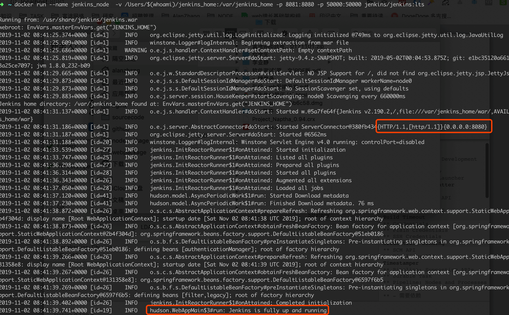
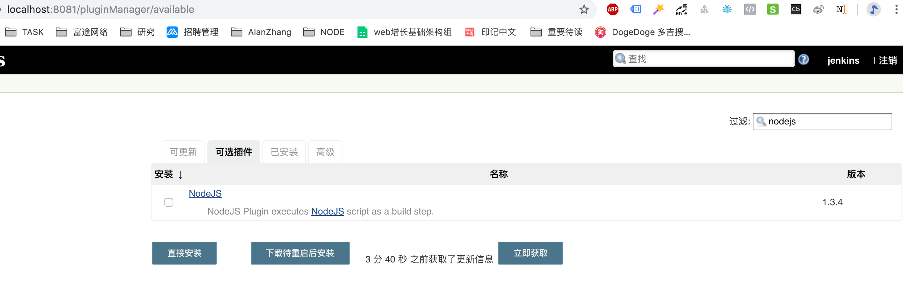
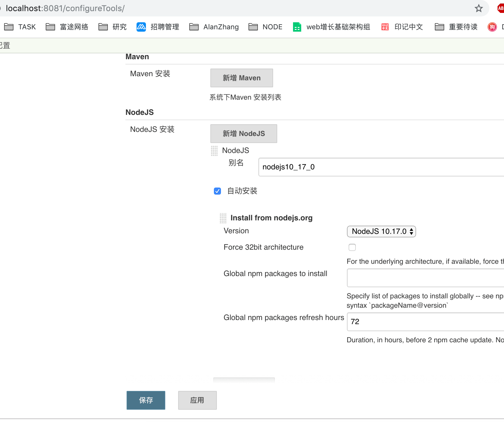

# docker 中部署jenkins

## 安装jenkins

```shell

# 1. 可以查找docker hub上发布的jenkins镜像，选择比较新的 jenkins/jenkins 镜像，等会安装，先知道这个命令
docker search jenkins

# 2. 创建一个本地目录，可用于在docker容器中挂载，简单理解为共享目录
mkdir /Users/$(whoami)/jenkins_home

# 3. 通过docker 安装jenkins
# -v: 表示把我们新建的jenkins_home目录映射到容器的/var/jenkins_home目录，注意，本地的目录路径需要是一个绝对路径
# -p: 端口映射，容器的 8080 端口映射到本机的 8081 端口。容器的 50000 端口映射到本机的 50000 端口。
# jenkins/jenkins:lts： 是我们刚刚search到的image
# 注意：这一步不要使用-d(后台运行模式)
docker run --name jenkins_node  -v /Users/$(whoami)/jenkins_home:/var/jenkins_home -p 8081:8080 -p 50000:50000 jenkins/jenkins:lts

# waiting....
# log会告诉你 启动成功 ：Started ServerConnector@380fb434{HTTP/1.1,[http/1.1]}{0.0.0.0:8080}
# .....
# Jenkins is fully up and running
# 【TIPS】如果失败，多试几次这步

# 4. 访问 http://localhost:8081/,会提示你在/var/jenkins_home/secrets/initialAdminPassword中有密码
# 根据3中的-v字段，可以知道，/var/jenkins_home/secrets/initialAdminPassword
# 在本地就是 /Users/$(whoami)/jenkins_home/secrets/initialAdminPassword
# 拿到密码登陆后台
cat /Users/$(whoami)/jenkins_home/secrets/initialAdminPassword

# 5. 后台提示自定义jenkins，选择安装推荐的插件
# waiting....
# waiting....
# waiting....
# 可以吃个饭再来，有点慢

# 6. 创建管理员用户,记住密码啥的完事
# 用户名：jenkins
# 密码：123456a
# 全名：jenkins
# 电子邮箱：alanzhang001@qq.com
# 接下来一路保存并完成，完事

# 7. 如果完成后，页面一面空白，就访问 localhost:8080/restart，重启jenkins即可

# 8. 后续再跑该镜像
# docker start jenkins_node

# 9. 再次启动时控制台可能没有日志，这么查看
docker logs --tail="10" jenkins_node
```

> 步骤3中为什么需要映射多个端口？

> 虽然推荐一个容器只做一件事情（一个服务），但是也存在一个服务需要多个端口的情况，比如邮件服务，收发需要使用多个端口。

> 本例中没有用到多端口，仅做记录

**安装完成**

**安装推荐插件**

**启动成功**


## 安装几个他的必备插件

#### nodejs

自动化的工作少不了nodejs

```shell
# 1. 进入http://localhost:8081/pluginManager/available，搜索nodejs,直接安装
# 或者通过 系统管理-插件管理-可选插件进入

# 2. 配置node版本，这步才是决定真正的node版本，从 http://localhost:8081/configureTools/ 进入，选择NodeJS 安装-新增 NodeJS
# 或者通过
# 这里选择了一个长期稳定的版本 node 10

```

**安装nodejs**
> 这个1.3.4并不是 node真正的版本，后面还是需要再选择的


**选择node版本**


## 配置jenkins任务

#### 自动化构建

以本项目为例，做测试，没啥可说的，直接上图吧。


#### 自动化部署

###### 1. 安装Publish Over SSH
jenkins 可用于制动化部署，说白了就是 登录目标主机、传输文件、执行一堆命令。


## 参考资料
- https://juejin.im/post/5db9474bf265da4d1206777e
